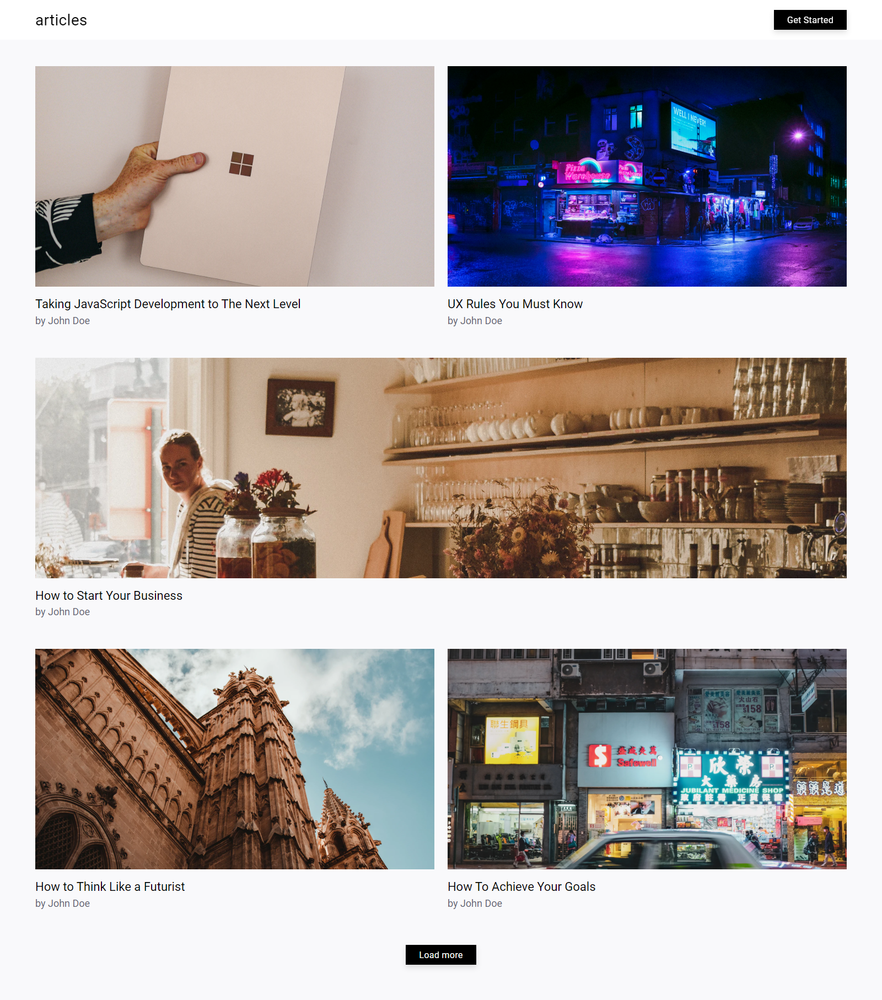
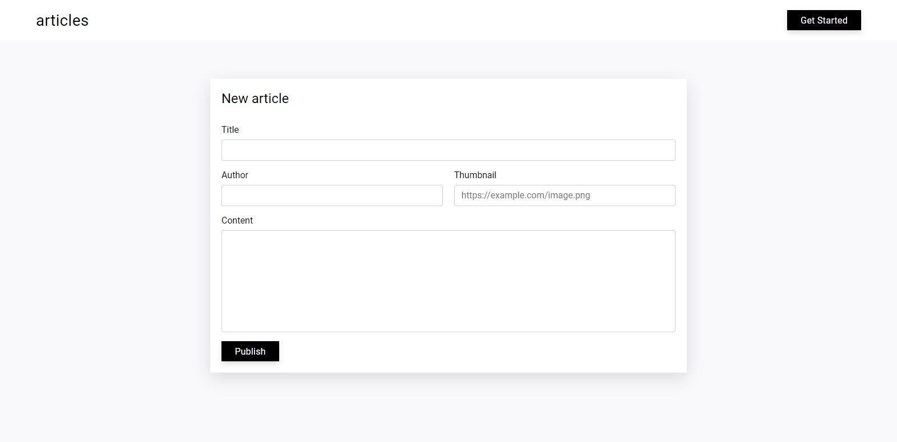
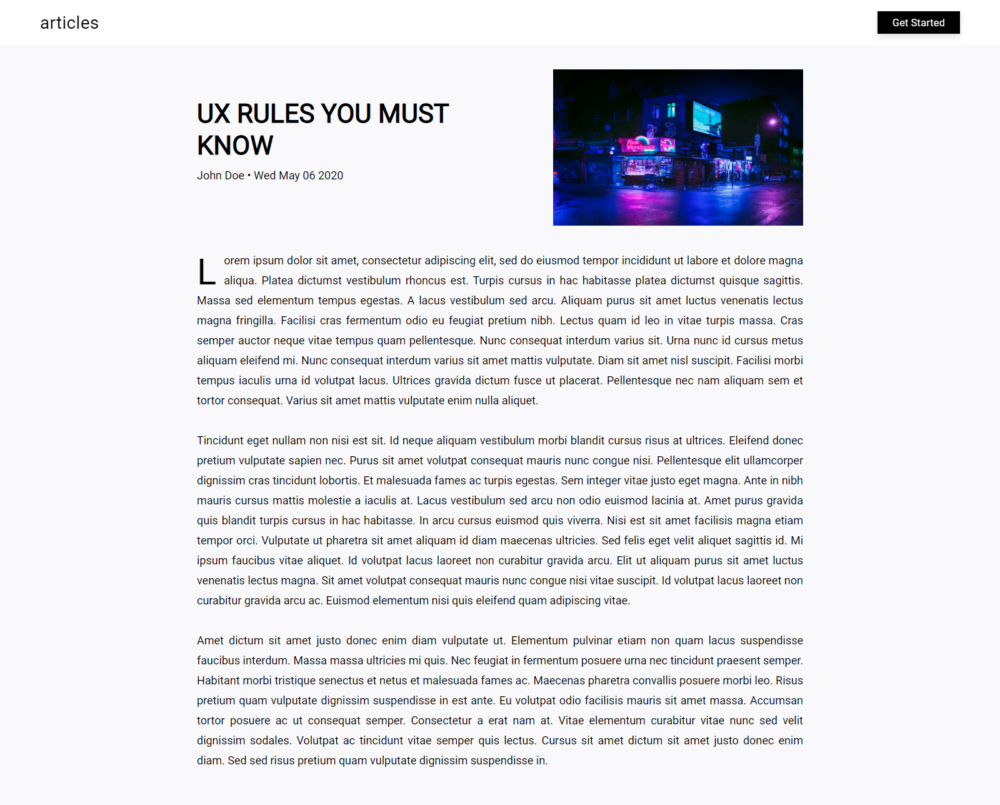

# React Articles

A simple and modern Single-Page Application for articles, built in a few hours with React, Redux, Redux-Saga, React Router and styled-components.

## Getting Started

### Installation

To get the project running locally:

1. Setup the [React Articles API](https://github.com/frahad/react-articles-api).

2. Clone this repository:

```
$ git clone https://github.com/frahad/react-articles-web
```

3. Open the project folder:

```
$ cd react-articles-web
```

4. Install all required dependencies:

```
$ yarn install
```

5. Run the app in development mode:

```
$ yarn start
```

6. Open [http://localhost:3000](http://localhost:3000) to view it in the browser.

## Third-party libraries

- `create-react-app` to create a React app with no build configuration.
- `redux` to manage the application state.
- `react-redux` to connect the React components to the Redux store.
- `redux-saga` to manage the application side effects (like data fetching).
- `react-router-dom` to define the application routing.
- `styled-components` to provide additional style for the components.
- `react-loading-skeleton` to improve the UX displaying a preview of the page's content until it loads.

## Screenshots

### Home page



### New article



### Article


